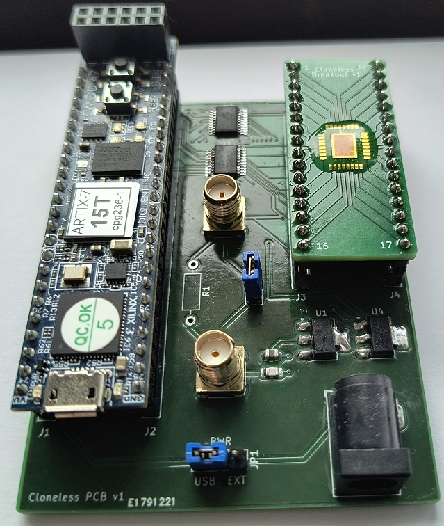
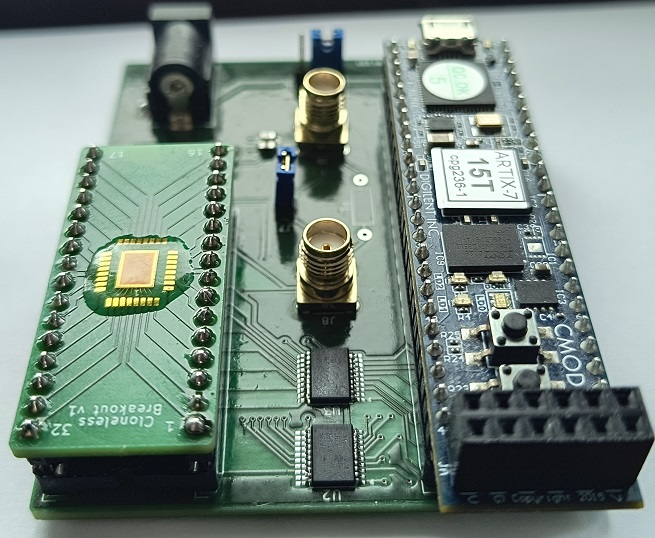

# Cloneless Artifacts
This repository contains PCB designs, FPGA controllers, verification collateral and software artifacts related to the Cloneless series of tamper-resistant open-source ASICs, in particular the [Cloneless1](https://github.com/ThorbenMoos/Cloneless1) chip.

## Layouts
 

## Photos
  